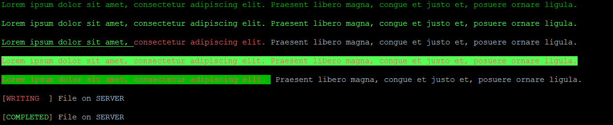

# Text Color

Python class With definitions of colors to print in bash terminals

## Getting Started

These instructions will get you a copy of the project up and running on your local machine for development and testing purposes. See deployment for notes on how to deploy the project on a live system.

### Prerequisites

Developed and tested in Linux Ubuntu and Python 2.7


### Installing

A step by step series of examples that tell you have to get a development env running

1. Create a folder called "text_color" inside the folder of your project.
2. Copy the text_color.py and `__init__.py` files to the text_color folder
3. Do class import for your project normally.

* If the import is successful, a file called checklist.pyc must be created, this file (compiled python file) must be maintained.

## Functions

### text_color

text_color():
Description: class With definitions of colors to print in bash terminals


## Deployment

Additional notes about how to deploy this on a live system:
Para deploy em ambiente de live:
1) Create a folder called "text_color" inside the folder of your project.
2) Copy the text_color.pyc and `__init__.pyc` files to the text_color folder

Note: Unless you really have experience, do not install directly on /usr/local/lib/python2.7/dist-packages

For next versions will be available installation by setup or pip.

## Examples of use

```
#################################################################################################################

from text_color import text_color
import sys

#################################################################################################################
    
print text_color.fg_Green + "Lorem ipsum dolor sit amet, consectetur adipiscing elit. Praesent libero magna, congue et justo et, posuere ornare ligula." + text_color.text_reset
print ' '
print text_color.fg_Bright_Green + "Lorem ipsum dolor sit amet, consectetur adipiscing elit. Praesent libero magna, congue et justo et, posuere ornare ligula." + text_color.text_reset
print ' '
print text_color.fg_Bright_Green + text_color.text_underline + "Lorem ipsum dolor sit amet, " + text_color.text_reset + text_color.fg_Bright_Red + "consectetur adipiscing elit. " + text_color.text_reset + "Praesent libero magna, congue et justo et, posuere ornare ligula." + text_color.text_reset
print ' '
print text_color.fg_Bright_Red + text_color.bg_Bright_Green + "Lorem ipsum dolor sit amet, consectetur adipiscing elit. Praesent libero magna, congue et justo et, posuere ornare ligula." + text_color.text_reset
print ' '
print text_color.fg_Bright_Red + text_color.bg_Green + "Lorem ipsum dolor sit amet, consectetur adipiscing elit. " + text_color.text_reset + " Praesent libero magna, congue et justo et, posuere ornare ligula." 
print ' '
print '[' + text_color.fg_Bright_Red + 'WRITING  ' + text_color.text_reset + '] File on SERVER' 
print ' '
print '[' + text_color.fg_Bright_Green + 'COMPLETED' + text_color.text_reset + '] File on SERVER' 
print ' '
#################################################################################################################

    
```



## Versioning
```
=======================================================================================
== Log Changes: 
== Date:            2018-04-03
== Author:          Fausto Branco
== Version:         1.0.0
== Description:     Initial Version
=======================================================================================

```
## Authors
```
=======================================================================================
== Script Info:		text_color.py - class With definitions of colors to print in bash terminals
==
=======================================================================================
== Create Author:	Fausto Branco
== Create Date:		2018-04-03
== Actual Version:  1.0.0
== Description:		
=======================================================================================
== Log Changes:
== Date:            2018-04-03
== Author:          Fausto Branco
== Version:         1.0.0
== Description:     Initial Version
=======================================================================================
```
## License


